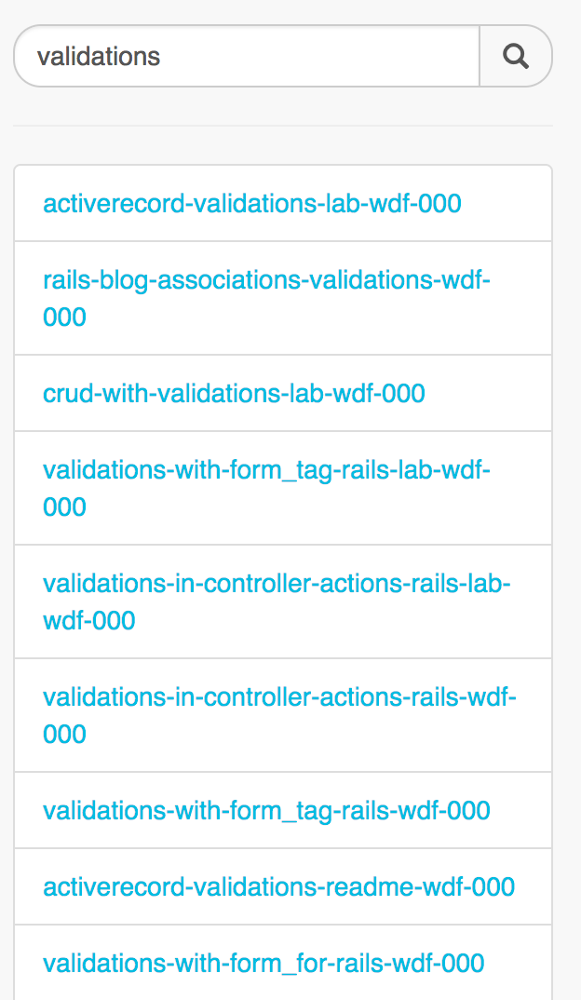
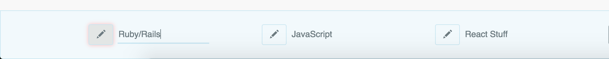
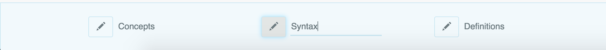
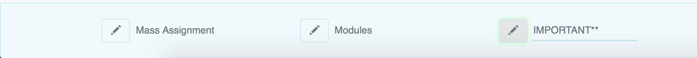
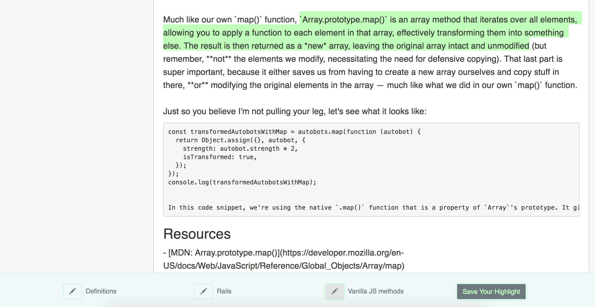
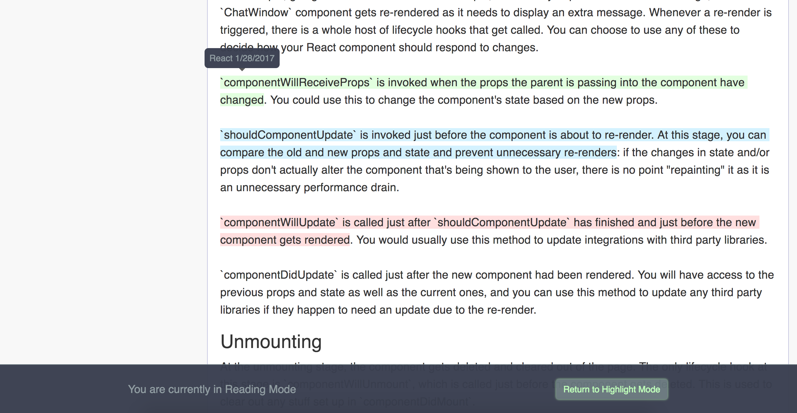
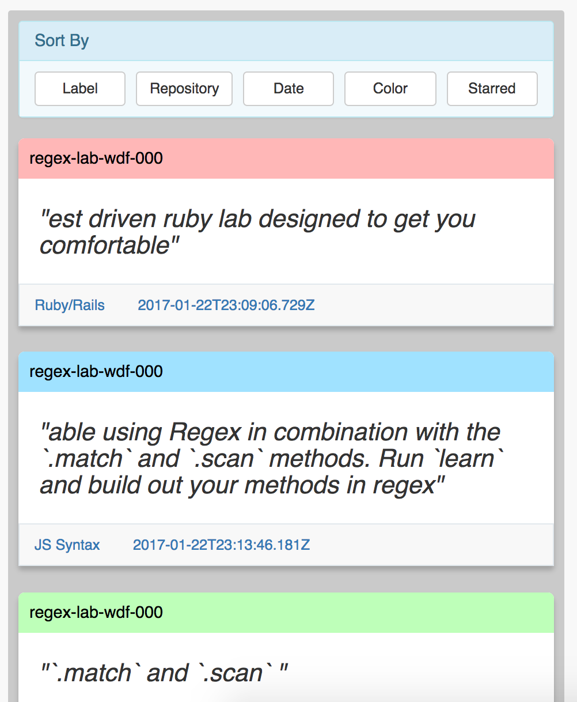
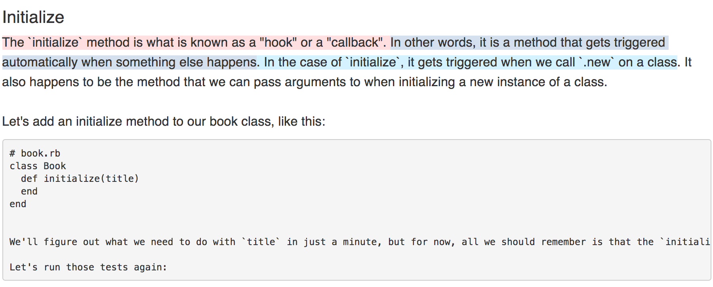

# Highlight

This app allows you to save, label, view and organize your notes from the readings and labs of the Learn.co curriculum.

## Features

#### Search your repositories

#### Color-code & label your Highlighters

#### Save your Notes

#### Enter Reading Mode and Review Notes from any Reading

#### Review and Sort all Notes

## Implementation Details
The app has a React & Redux frontend with an Express & Mongo backend. Some of the more interesting React components would be the `Note` and `Text` Components. Each of these take the markdown of a repository's readme from the Github API and display the content as React components.  Check out `src/utilities/markdown_parser.js` to see how the raw markdown is converted to an Array of vanilla JS Objects containing the relevant content and information.

The `RepoShow` component found in `src/components/repositories` is responsible for either rendering `Text` or `Note` components (the relevant files can be found in the same directory).  

`Text` components are rendered when the user selects a repository to view. The data from the markdown parser is turned into React components that are listening for a mouse-up event to occur.  When it does, and if valid text is selected, the user can save their highlight.  What is persisted is the start index of the selected text within the text of it's containing element, the actual text of the highlighted content (the more important data for later displaying the highlights is the length of the selection, though the actual text is needed to show on the 'notes index' page), and some additional data on the highlighter color and label.

A `Note` component is rendered when the user clicks 'View' to see their previous highlights within a reading.  Essentially, it uses the persisted start-indices and calculated end-indices to find the points where `` tags should be inserted into the text. Since inserting the first `` throws off all future index/span-insertion-points there is some involved logic here getting the data in a useful format.  The algorithm can recursively build spans within spans with the children being the text-content `slice`d at the appropriate points.

A `` entirely nested within another `` is not too difficult of an edge-case, but a `` that begins inside of another `` and ends outside is more difficult. Ex:

This problem is solved by creating two ``s that represent the blue text selection. The red `` opens, then the blue opens, then the blue prematurely closes, and the red closes finishing the red highlight. Then a brand-new span opens and closes to gather the remainder of the blue highlighted text. It is still persisted as one highlight, but displayed across two elements.

This project was bootstrapped with [Create React App](https://github.com/facebookincubator/create-react-app).
